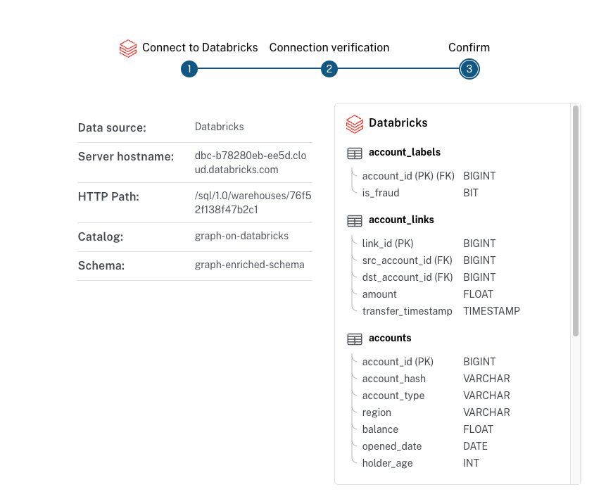
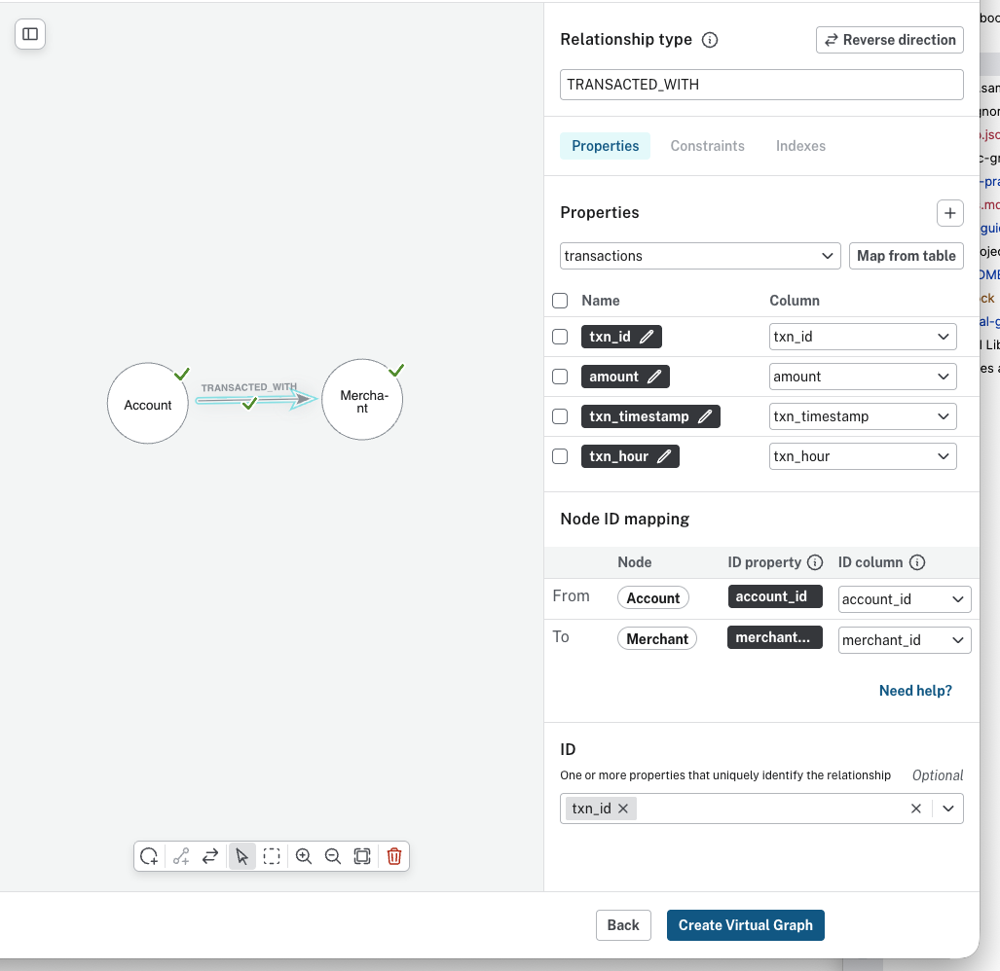
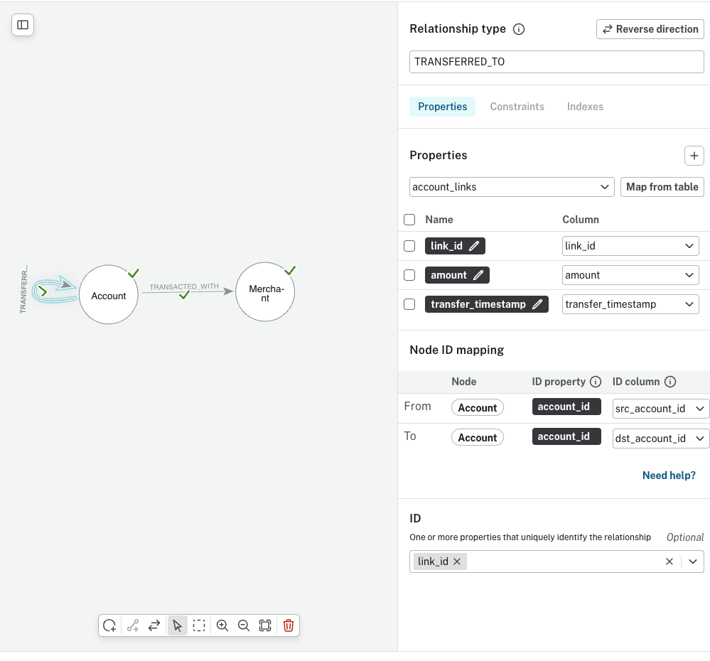
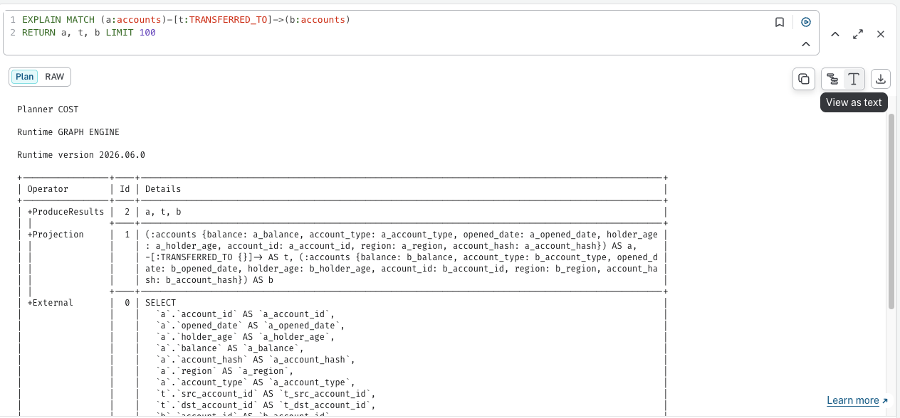

# Virtual Graph Setup for Finance Genie

Neo4j Virtual Graph lets you query Databricks tables as a property graph in Aura without copying the data into Neo4j first. This walkthrough sets up a Virtual Graph over the Finance Genie Silver tables, so you can explore accounts and transfers with Cypher while the data stays in Unity Catalog.

> Virtual Graph is in public preview. The official docs advise against using sensitive or production data with it during the preview. It is available to AuraDB Professional and Business Critical customers. Billing started on 2026-09-01, and instances use Aura Credits based on their memory size.
>
> Start with a small test dataset to get a feel for the warehouse traffic Virtual Graph generates. The docs warn that large datasets combined with computation-heavy queries might incur unexpected costs.

## 1. Create the Silver tables

Before setting up the Virtual Graph, run [`notebooks/01_setup_lakehouse.ipynb`](notebooks/01_setup_lakehouse.ipynb) in your Databricks workspace. It downloads the Finance Genie dataset, stages the CSVs into a Unity Catalog Volume, and creates the base tables. The Virtual Graph reads those tables, so they must exist first. See the [project README](./README.md) for the full setup steps.

The tables you will model are the Finance Genie Silver tables: `accounts`, `merchants`, `transactions`, and `account_links`. The `account_labels` table stays out of the graph. It holds the fraud ground truth used for evaluation, not graph structure.

## 2. Prepare Databricks

Aura connects to Databricks over a SQL warehouse using a personal access token. Collect the following from your Databricks workspace.

### Create an access token

1. Select **Settings** from the user menu at the top right.
2. Select **Developer** under **User** in the **Settings** menu.
3. Select **Manage** next to **Access tokens**.
4. In the **Generate new token** menu, enter a name and a lifetime in days, and select `sql` as the API scope.
5. Select **Generate** and copy the token.

Virtual Graph needs only read-only access to the data source. The official docs say to limit tokens and other authentication to read-only access. Aura runs every generated SQL query as the token's principal, not as the Neo4j user, so Unity Catalog permissions and row filters apply. Grant that principal `USE CATALOG`, `USE SCHEMA`, and `SELECT` on the Finance Genie schema, plus `CAN USE` on the SQL warehouse. Consider a dedicated service principal rather than a personal token. Virtual Graph checks that every mapped table and column is readable at startup and fails if the principal cannot access one.

### Look up the server information

To find your **Server hostname** and **HTTP Path**:

1. Select **SQL Warehouses** from the left-side navigation.
2. Select the SQL warehouse you want to query through.
3. Open the **Connection details** tab to read the **Server hostname** and **HTTP Path**.

To find your catalog and schema:

1. Select **Catalog** from the left-side navigation.
2. Select your catalog.
3. The **Overview** tab lists the available schemas.

For Finance Genie, the catalog and schema are the ones the setup notebook created. The notebook sets them as `CATALOG` and `SCHEMA` in its configuration cell.

## 3. Create the Virtual Graph in Aura

In the Aura console:

1. Select **Instances** from the left-side navigation.
2. Open the **Virtual Graphs** tab and select **Create virtual graph**.
3. In the **Configure Virtual Graph** step, choose a name, a cloud provider, and a memory volume.

### Connect Databricks as the data source

1. Select **Add new data source** and choose **Databricks**.
2. Complete the form:
   - Assign the data source a name.
   - Enter the **Server hostname** and **HTTP Path** from the SQL warehouse connection details.
   - Enter the personal access token you generated.
   - Enter the **Catalog** and **Schema** that hold the Finance Genie tables.
3. Select **Next** and wait for the connection to be verified, then **Confirm**.

### Confirm the setup worked

When the connection verifies, the **Confirm** step lists your Databricks data source along with the discovered tables and columns. A successful Finance Genie setup looks like this:



The panel shows the data source set to Databricks with the server hostname, HTTP path, catalog, and schema you entered, and the discovered tables on the right. The table list is scrollable; the screenshot shows the top of it:

- `account_labels` with `account_id` and `is_fraud`
- `account_links` with `link_id`, `src_account_id`, `dst_account_id`, `amount`, and `transfer_timestamp`
- `accounts` with `account_id`, `account_hash`, `account_type`, `region`, `balance`, `opened_date`, and `holder_age`

Scroll down to see the remaining two tables, `merchants` and `transactions`. All five Silver tables are discovered. Seeing these tables and columns confirms that Aura can reach the warehouse and read the Finance Genie schema.

## 4. Select a graph model

Under **Select graph model**, choose **Create new graph model**. You populate this empty model in the next step.

The model editor offers three ways to start: **Define manually**, **Generate from schema**, and **Generate with AI**. This walkthrough uses **Generate from schema**, which enforces unique node labels and relationship types. The docs note that a model generated with AI cannot guarantee that uniqueness, so check any AI-generated model before saving it.

## 5. Define your schema

**Generate from schema** turns every discovered table into a node, including the `transactions` and `account_links` join tables. The Finance Genie graph needs those two tables modeled as relationships instead, and it leaves `account_labels` out of the graph entirely. The label is the fraud ground truth, so keeping it out of the graph preserves it as a held-out evaluation target rather than a feature.

The target model is two node types and two relationship types:

- `:Account` nodes from the `accounts` table
- `:Merchant` nodes from the `merchants` table
- `TRANSACTED_WITH` relationships (`:Account` → `:Merchant`) from the `transactions` table
- `TRANSFERRED_TO` relationships (`:Account` → `:Account`) from the `account_links` table

The names follow Neo4j conventions. Node labels are singular PascalCase, such as `Account`. Relationship types are UPPER_SNAKE_CASE, such as `TRANSFERRED_TO`. The Databricks tables keep their plural SQL names, such as `accounts`. The model maps one to the other. Every query in this project uses `:Account` and `:Merchant`, so they fail against a model that still has the generated `:accounts` / `:merchants` labels.

Build that model with the following steps.

1. Remove `account_labels` from the data source so Aura does not model it.
2. Select **Generate from schema**. Aura infers nodes and relationships from the remaining table schema and foreign keys.
3. Remove every relationship Aura generated. You will recreate the two you need by hand so the node ID mappings are explicit.
4. Remove the `transactions` and `account_links` nodes. These are edge tables and become relationships, not nodes.
5. Rename the two remaining node labels. **Generate from schema** labels each node after its table, so the nodes arrive as `accounts` and `merchants`. Change the label of `accounts` to `Account` and the label of `merchants` to `Merchant`. Leave the backing tables unchanged.
6. Create the `TRANSACTED_WITH` relationship, as shown below:

   - Set the **Relationship type** to `TRANSACTED_WITH`.
   - Under **Properties**, map from the `transactions` table:

     | Property | Type | Map from column |
     |----------|------|-----------------|
     | `txn_id` | integer | `txn_id` |
     | `amount` | float | `amount` |
     | `txn_timestamp` | datetime | `txn_timestamp` |
     | `txn_hour` | integer | `txn_hour` |

     Set the **id** to `txn_id`.
   - Under **Node ID mapping**, set **From** to `Account`, with ID property `account_id` mapped from ID column `account_id`.
   - Set **To** to `Merchant`, with ID property `merchant_id` mapped from ID column `merchant_id`.

   

7. Create the `TRANSFERRED_TO` relationship, as shown below. Both ends map to the `Account` node; the source and destination differ only by which column supplies the ID:

   - Set the **Relationship type** to `TRANSFERRED_TO`.
   - Under **Properties**, map from the `account_links` table:

     | Property | Type | Map from column |
     |----------|------|-----------------|
     | `link_id` | integer | `link_id` |
     | `amount` | float | `amount` |
     | `transfer_timestamp` | datetime | `transfer_timestamp` |

     Set the **id** to `link_id`.
   - Under **Node ID mapping**, set **From** to `Account`, with ID property `account_id` mapped from ID column `src_account_id`.
   - Set **To** to `Account`, with ID property `account_id` mapped from ID column `dst_account_id`.

   

8. Select **Create Virtual Graph** to save the model, and download the credentials file when prompted. The instance password cannot be changed later and is not recoverable. If you lose it, you must delete and recreate the Virtual Graph.

## Indexes for the model

The model editor exposes an **Indexes** tab on both nodes and relationships, alongside the
**Properties** and **Constraints** tabs. Add an index with `+` and pick a property; the
index type is Neo4j's default `range` index.

The model already carries four indexes after the steps above, all created for you:

- `Account.account_id` and `Merchant.merchant_id`, the range indexes that back each node's
  ID uniqueness constraint.
- `TRANSACTED_WITH.txn_id` and `TRANSFERRED_TO.link_id`, from the optional relationship
  **ID** property set on each relationship.

None of those sit on the columns the demo queries filter by. The fraud queries and the GDS
session window all filter on timestamps, amounts, and account dates, not on the ID
columns. The Aura Import guidance is to add a range index to any property you regularly
filter by range. The five additions below map to the queries in
[`finding-fraud.md`](docs/finding-fraud.md) and the GDS path in [`gds-guide.md`](gds-guide.md),
ordered by how many queries each one serves:

| Index | Type | Backs |
|-------|------|-------|
| `TRANSFERRED_TO.transfer_timestamp` | range | The GDS session window (`WHERE t.transfer_timestamp >= $since`), Collection accounts (query 5), Spray accounts (query 6), and the collection / spray finder queries. Highest coverage. |
| `TRANSFERRED_TO.amount` | range | Structuring (query 1), the selective `>= 9000 AND < 10000` filter. |
| `Account.opened_date` | range | New accounts moving large sums (query 2). |
| `Account.balance` | range | Velocity ratio (query 4). |
| `TRANSACTED_WITH.txn_timestamp` | range | Shared-merchant burst and any merchant time-window query. |

For the GDS session specifically, the projection query is
`MATCH (src:Account)-[t:TRANSFERRED_TO]->(dst:Account) WHERE t.transfer_timestamp >= $since`.
The index that maps to it is `TRANSFERRED_TO.transfer_timestamp`, the same index that
serves the fan-in and fan-out fraud queries, so it is the single highest-value addition.

Skip these, with the reason:

- `Account.account_id` and `Merchant.merchant_id` are already indexed by their uniqueness
  constraints, so the anchored visualization lookups such as `{account_id: 184}` are
  already covered.
- `account_type`, `region`, and merchant `category` are `GROUP BY` keys, not selective
  range filters, and a range index does not help a grouping scan.
- `txn_hour` and `holder_age` are not filtered selectively by any demo query.
- `TRANSACTED_WITH.amount` has no range filter in the current fraud query set. Add it later
  only if a merchant-amount threshold query joins the set.

One caveat applies. Whether a model range index changes a Virtual Graph's execution is
unverified. Every performance lever in [`best-practices.md`](best-practices.md) is query
shape, warehouse size, or the connection pool. The backing Delta tables have no B-tree
index for a range index to translate into. Treat these additions as a near-zero-cost way
to align the model with Neo4j and Aura Import best practice. They carry no measured
speed-up. The proven levers stay the ones in
[`best-practices.md`](best-practices.md): scalar group keys, time windows to keep result
sets small, warehouse size, and one query at a time. To check the effect of an index,
prefix a query with `EXPLAIN` and compare the generated SQL and timing before and after
adding it.

## 6. Inspect your graph

Select **Query** from the left-side navigation and run Cypher against the Virtual Graph. Aura compiles each query into SQL and pushes most of the work to your Databricks warehouse; graph-specific operations run in Neo4j's graph compute layer.

### Transfers between accounts

To see transfers between accounts:

```cypher
MATCH (a:Account)-[t:TRANSFERRED_TO]->(b:Account)
RETURN a, t, b LIMIT 100
```

To see the Cypher-to-SQL translation, add `EXPLAIN` to the front of the query:

```cypher
EXPLAIN MATCH (a:Account)-[t:TRANSFERRED_TO]->(b:Account)
RETURN a, t, b LIMIT 100
```

`EXPLAIN` returns the query plan with the generated SQL instead of running the query:



### Account balance tiers

To group accounts into balance tiers and summarize each tier:

```cypher
MATCH (a:Account)
WITH a,
     CASE WHEN a.balance < 10000 THEN 'low'
          WHEN a.balance < 100000 THEN 'mid'
          ELSE 'high' END AS balance_tier
RETURN balance_tier,
       count(a) AS accounts,
       round(avg(a.balance), 2) AS avg_balance,
       min(a.holder_age) AS min_age,
       max(a.holder_age) AS max_age
ORDER BY accounts DESC
```

Add `EXPLAIN` to the front to see its SQL translation:

```cypher
EXPLAIN MATCH (a:Account)
WITH a,
     CASE WHEN a.balance < 10000 THEN 'low'
          WHEN a.balance < 100000 THEN 'mid'
          ELSE 'high' END AS balance_tier
RETURN balance_tier,
       count(a) AS accounts,
       round(avg(a.balance), 2) AS avg_balance,
       min(a.holder_age) AS min_age,
       max(a.holder_age) AS max_age
ORDER BY accounts DESC
```

### Top merchants by spend

To find which merchants pull the most money, and from how many distinct accounts:

```cypher
MATCH (a:Account)-[t:TRANSACTED_WITH]->(m:Merchant)
RETURN m.merchant_name AS merchant,
       m.category       AS category,
       count(t)         AS txns,
       count(DISTINCT a) AS customers,
       round(sum(t.amount), 2) AS total_spend
ORDER BY total_spend DESC
LIMIT 20
```

### Spend by merchant category

To roll spend up to the category level, the merchant analogue of the balance-tier query above:

```cypher
MATCH (:Account)-[t:TRANSACTED_WITH]->(m:Merchant)
RETURN m.category AS category,
       count(t)   AS txns,
       round(sum(t.amount), 2) AS total_spend,
       round(avg(t.amount), 2) AS avg_txn
ORDER BY total_spend DESC
```

### Off-hours activity per merchant

To surface merchants with unusual late-night volume, filter on `txn_hour < 6`. That window covers midnight to 5 AM.

```cypher
MATCH (:Account)-[t:TRANSACTED_WITH]->(m:Merchant)
WHERE t.txn_hour < 6
RETURN m.merchant_name AS merchant,
       count(t)        AS offhours_txns,
       round(sum(t.amount), 2) AS offhours_spend
ORDER BY offhours_txns DESC
LIMIT 20
```

### A single merchant's customers

To build an ego network around one merchant, anchor on its `merchant_id`:

```cypher
MATCH (a:Account)-[t:TRANSACTED_WITH]->(m:Merchant {merchant_id: 42})
RETURN a, t, m LIMIT 100
```

### Accounts sharing a merchant

To find two accounts that both pay the same merchant, use this unanchored form of the shared-merchant query in [`basic-graph-examples.md`](basic-graph-examples.md#10-two-hop-accounts-linked-through-a-shared-merchant):

```cypher
MATCH (a:Account)-[:TRANSACTED_WITH]->(m:Merchant)<-[:TRANSACTED_WITH]-(b:Account)
WHERE a.account_id < b.account_id
RETURN m.merchant_name AS merchant,
       a.account_id AS account_a,
       b.account_id AS account_b,
       count(*)     AS shared_txns
ORDER BY shared_txns DESC
LIMIT 20
```

When the queries return accounts and their transfers, the Finance Genie Virtual Graph is live and reading directly from Databricks.

## Keep learning

- [Quickstart: Databricks](https://neo4j.com/docs/virtual-graph/aura/getting-started-databricks/) for the source workflow this walkthrough is based on.
- [Virtual Graph data sources](https://neo4j.com/docs/virtual-graph/aura/data-sources/) for other connection options.
- [Virtual graph models](https://neo4j.com/docs/virtual-graph/aura/models/) for schema fine-tuning and entity type uniqueness.
- [Cypher coverage](https://neo4j.com/docs/virtual-graph/aura/cypher-coverage/) for the current Cypher limitations.
- [SQL queries](https://neo4j.com/docs/virtual-graph/aura/sql-queries/) for reading the generated SQL with `EXPLAIN`.
- [GDS](https://neo4j.com/docs/virtual-graph/aura/gds/) for running graph algorithms through GDS Sessions.
- [GraphAcademy: Virtual Graph with Databricks](https://graphacademy.neo4j.com/courses/virtual-graph-databricks) for a guided course.

## When to model transactions as nodes

This walkthrough maps the `transactions` and `account_links` fact tables to relationships rather than nodes. That is a deliberate modeling choice, and it is the correct one for the current scope.

The Neo4j rule is to model a connection as a relationship and only promote it to a node when one of these holds:

- The connection links three or more entities, so a relationship cannot express it.
- Something else needs to point at the event itself, such as a dispute, a chargeback, a device, or another transaction in a chain.
- The event is a first-class entity you traverse to, sequence over time, or run graph algorithms over.
- The event carries rich attributes you expect to grow well beyond a few scalar fields.

A Finance Genie transaction meets none of these today. It is a clean bipartite fact: one account, one merchant, with `amount`, `txn_timestamp`, and `txn_hour` mapping directly onto relationship properties. The `txn_id` primary key carries over as a relationship property when you need stable edge identity. Transfers in `account_links` are the same shape: a single account-to-account dyad that belongs on a `TRANSFERRED_TO` relationship. The relationship model is also cheaper in a Virtual Graph, where every node hop becomes an additional SQL join against Databricks.

Reconsider and promote transactions to a `:Transaction` node when the data crosses one of the thresholds above. The common triggers in fraud work are:

- Money-flow chains, where you trace funds through a sequence of linked transactions to detect layering or mule activity.
- A third entity attaching to the event, such as a device, IP, session, or a dispute record that references a specific transaction.
- Shared-event motifs, where many accounts funnel into one event and the transaction node is the shared center.
- Graph algorithms run over the event graph itself.

When that happens, the upgrade path is `(:Account)-[:PERFORMED]->(:Transaction)-[:PAID_TO]->(:Merchant)`, using `txn_id` as the node key.
